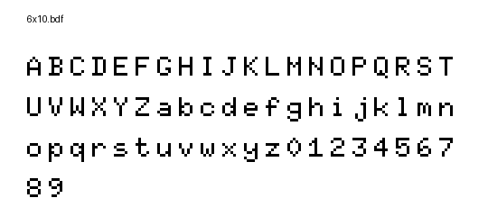
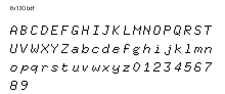
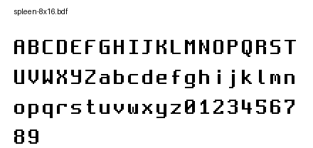

# BDF Fonts with Previews

These are BDF fonts, a simple bitmap font-format that can be created
by many font tools. Given that these are bitmap fonts, they will look good on
very low resolution screens such as the LED displays.

Fonts in this directory (except tom-thumb.bdf) are public domain (see the [README](./README)) and
help you to get started with the font support in the API or the `text-util`
from the utils/ directory.

Tom-Thumb.bdf is included in this directory under [MIT license](http://vt100.tarunz.org/LICENSE). Tom-thumb.bdf was created by [@robey](http://twitter.com/robey) and originally published at https://robey.lag.net/2010/01/23/tiny-monospace-font.html

## Installation

This repository includes a Python script to generate previews of the BDF fonts. To set up the environment:

1. Clone this repository:
   ```bash
   git clone https://github.com/username/bdf-fonts-with-previews.git
   cd bdf-fonts-with-previews
   ```

2. Run the installation script to create a virtual environment and install dependencies:
   ```bash
   ./install.sh
   ```

## Usage

### Generate a single font preview

```bash
# Activate the virtual environment
source venv/bin/activate

# Generate preview for a single font
python preview.py /path/to/font.bdf output.png
```

### Generate previews for all included fonts

```bash
# The generate.sh script will create previews for all included fonts
./generate.sh
```

The previews will be saved in the `previews/` directory.

## Font Gallery

Below is a gallery of all the included BDF fonts. Click on any font name to see its preview.

| Font Name | Size | Preview |
|-----------|------|---------|
| [4x6](./previews/4x6.bdf.png) | 4×6 |  |
| [5x7](./previews/5x7.bdf.png) | 5×7 |  |
| [5x8](./previews/5x8.bdf.png) | 5×8 |  |
| [6x9](./previews/6x9.bdf.png) | 6×9 |  |
| [6x10](./previews/6x10.bdf.png) | 6×10 |  |
| [6x12](./previews/6x12.bdf.png) | 6×12 |  |
| [6x13](./previews/6x13.bdf.png) | 6×13 |  |
| [6x13B](./previews/6x13B.bdf.png) | 6×13 Bold |  |
| [6x13O](./previews/6x13O.bdf.png) | 6×13 Oblique |  |
| [7x13](./previews/7x13.bdf.png) | 7×13 |  |
| [7x13B](./previews/7x13B.bdf.png) | 7×13 Bold |  |
| [7x13O](./previews/7x13O.bdf.png) | 7×13 Oblique |  |
| [7x14](./previews/7x14.bdf.png) | 7×14 |  |
| [7x14B](./previews/7x14B.bdf.png) | 7×14 Bold |  |
| [8x13](./previews/8x13.bdf.png) | 8×13 |  |
| [8x13B](./previews/8x13B.bdf.png) | 8×13 Bold |  |
| [8x13O](./previews/8x13O.bdf.png) | 8×13 Oblique |  |
| [9x15](./previews/9x15.bdf.png) | 9×15 |  |
| [9x15B](./previews/9x15B.bdf.png) | 9×15 Bold |  |
| [9x18](./previews/9x18.bdf.png) | 9×18 |  |
| [9x18B](./previews/9x18B.bdf.png) | 9×18 Bold |  |
| [10x20](./previews/10x20.bdf.png) | 10×20 |  |
| [clR6x12](./previews/clR6x12.bdf.png) | clR 6×12 |  |
| [creep](./previews/creep.bdf.png) | Creep |  |
| [helvR12](./previews/helvR12.bdf.png) | Helvetica 12 |  |
| [knxt](./previews/knxt.bdf.png) | KNXT |  |
| [peep-10x20](./previews/peep-10x20.bdf.png) | Peep 10×20 |  |
| [scientifica-11](./previews/scientifica-11.bdf.png) | Scientifica 11 |  |
| [scientificaBold-11](./previews/scientificaBold-11.bdf.png) | Scientifica Bold 11 |  |
| [scientificaItalic-11](./previews/scientificaItalic-11.bdf.png) | Scientifica Italic 11 |  |
| [spleen-5x8](./previews/spleen-5x8.bdf.png) | Spleen 5×8 |  |
| [spleen-8x16](./previews/spleen-8x16.bdf.png) | Spleen 8×16 |  |
| [spleen-12x24](./previews/spleen-12x24.bdf.png) | Spleen 12×24 |  |
| [spleen-16x32](./previews/spleen-16x32.bdf.png) | Spleen 16×32 |  |
| [spleen-32x64](./previews/spleen-32x64.bdf.png) | Spleen 32×64 |  |
| [tom-thumb](./previews/tom-thumb.bdf.png) | Tom Thumb |  |
| [HaxorMedium-10](./previews/HaxorMedium-10.bdf.png) | Haxor Medium 10 |  |
| [HaxorMedium-11](./previews/HaxorMedium-11.bdf.png) | Haxor Medium 11 |  |
| [HaxorMedium-12](./previews/HaxorMedium-12.bdf.png) | Haxor Medium 12 |  |
| [HaxorMedium-13](./previews/HaxorMedium-13.bdf.png) | Haxor Medium 13 |  |
| [HaxorNarrow-15](./previews/HaxorNarrow-15.bdf.png) | Haxor Narrow 15 |  |
| [HaxorNarrow-16](./previews/HaxorNarrow-16.bdf.png) | Haxor Narrow 16 |  |
| [HaxorNarrow-17](./previews/HaxorNarrow-17.bdf.png) | Haxor Narrow 17 |  |
| [PsevdoAzbukaMedium-12](./previews/PsevdoAzbukaMedium-12.bdf.png) | PsevdoAzbuka Medium 12 |  |
| [logisoso46](./previews/logisoso46.bdf.png) | Logisoso 46 |  |

## Dependencies

- Python 3.6+
- Pillow (Python Imaging Library)
- argparse

These dependencies will be automatically installed when you run the `install.sh` script.
